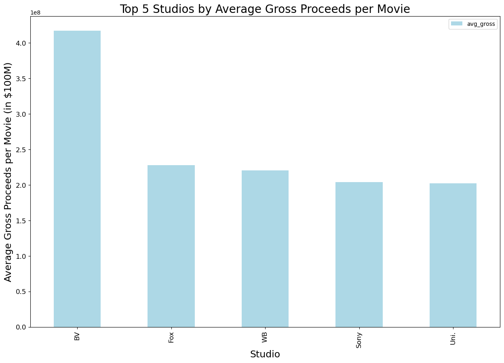
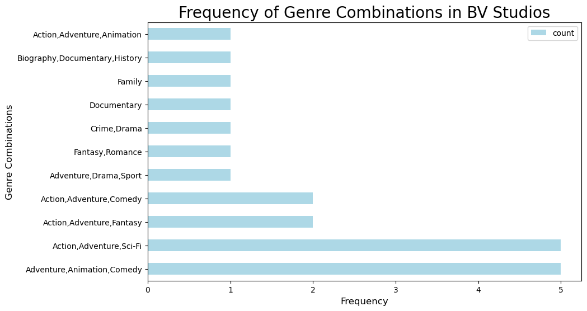
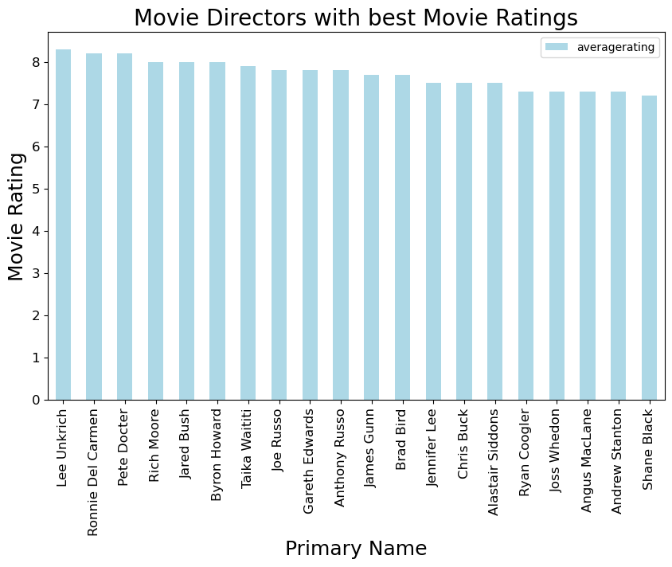

# MICROSOFT STUDIO PROJECT

## Project Overview

This project delves into the analysis of top-performing films at the box office, aiming to provide actionable insights into the types of movies Microsoft Movie Studios should produce. Through exploratory data analysis, the project offers valuable guidance on target audience, genres, and performance indicators crucial for a film's success. Microsoft Movie Studios can leverage these insights to craft compelling content and strategic considerations for long-term success.

### Business Problem

Microsoft seeks to establish a movie studio and venture into film production, yet lacks prior experience in the industry. The success of a movie studio hinges on its ability to produce films that resonate with audiences while generating substantial revenue. This project serves as a vital tool for stakeholders and Microsoft Movie Studios, offering insights into the types of films performing well in the box office. By analyzing box office data, stakeholders can make informed decisions, mitigate risks, and enhance the prospects of financial success.

### The Data

The Data
In the folder zippedData are movie datasets from:
* [Box Office Mojo](https://www.boxofficemojo.com/)
Box Office Mojo supplies extensive information on box office performances, including revenue, budgets, and release details

* [IMDB](https://www.imdb.com/)
IMDB serves as a comprehensive source for movie-related information such as ratings, cast, crew, and plot summaries

* [Rotten Tomatoes](https://www.rottentomatoes.com/)
Rotten Tomatoes aggregates reviews from critics and audience members, offering insights into movie reception and audience scores.

* [TheMovieDB](https://www.themoviedb.org/)

* [The Numbers](https://www.the-numbers.com/)

Because it was collected from various locations, the different files have different formats. Some are compressed CSV (comma-separated values) or TSV (tab-separated values) files that can be opened using spreadsheet software or `pd.read_csv`, while the data from IMDB is located in a SQLite database.

The data used mainly in this project was:
* `im.db.zip`
  * Zipped SQLite database (you will need to unzip then query using SQLite)
  * `movie_basics` and `movie_ratings` tables are most relevant
* `bom.movie_gross.csv.gz`

### deliverables for this project:

* A Microsoft presentation pdf
* A Microsoft studio project ipynb
* A Github repository

## Results
A graph showing top 5 leading studios by the gross income

A graph that shows top genre movie combinations

      

 A graph that shows the leading directors by movie ratings
 

       
       
  * Conclusion

1.Ratings drive decision-making:

Ratings provide valuable feedback on how well a film has received and the overall quality of a film. Positive ratings contribute to positive word-of-mouth driving audience attendance and marketing/promotional materials to attract audiences. Microsoft should endeavour to create films of high quality as positive ratings help establish a studio's credibility and create a loyal audience base. By continuing to monitor audience reactions, scores on platforms like IMDB and other sites, Microsoft can gain insights into what worked well and what could be improved which is invaluable for tailoring future content to better align with audiences.
Microsoft should also keep in mind that the ratings can be skewed by the number of votes and the demographic of audience whom are voting. Ratings are inherently subjective and vary based on the individual e.g. critics may focus on artistic elements but the general audience prioritises entertainment.

2.Create films in the Adventure genre;
 
ideally start with an Adventure, Action and Sci-Fi film: The top 20 grossing films have a combination of genres that include Adventure. Microsoft Movie Studios should identify what their target audience wants and capitalize on the type of content they want to see. As they are a fledging movie studio, not only do audiences find entertainment value in the Adventure genre, these types of films are among the most profitable, so the studios should start by creating films which include this genre to have the best chance of success. Most films are not a single genre only and the most frequent combination of genres is Adventure, Action and Sci-fi in our top grossing films so Microsoft should start with making one of these.

3.Lastly, Microsoft should consider collaborating with or hiring directors like Lee Unkrinch,Ronee Del Carmen and Pete Docter who have a proven track record of delivering top-rated films. By partnering with
 

